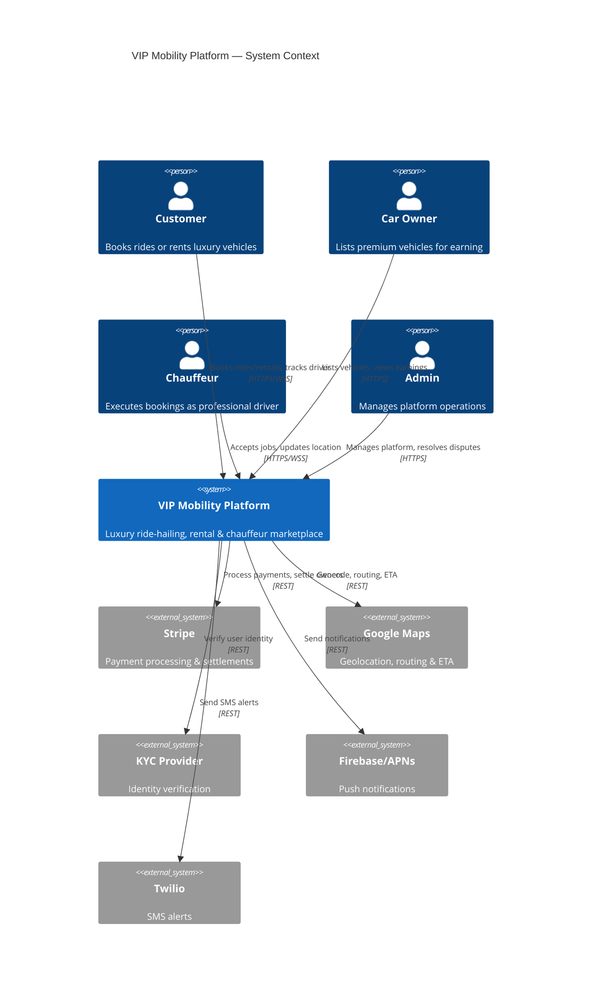
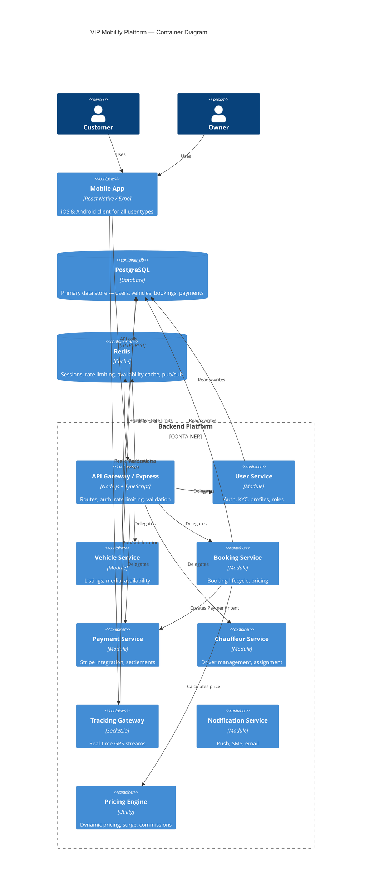

# VIP Mobility Platform — System Design

**Version**: 1.0.0  
**Date**: 2026-04-06  
**Architect**: CTO / Software Architect Agent  
**Status**: Accepted

---

## Table of Contents

1. [System Context](#1-system-context)
2. [Container Architecture](#2-container-architecture)
3. [Service Decomposition](#3-service-decomposition)
4. [Data Flow](#4-data-flow)
5. [API Gateway Design](#5-api-gateway-design)
6. [Event-Driven Patterns](#6-event-driven-patterns)
7. [Architecture Decision Records](#7-architecture-decision-records)
8. [Non-Functional Requirements](#8-non-functional-requirements)

---

## 1. System Context



---

## 2. Container Architecture



---

## 3. Service Decomposition

### UserService
**Responsibility**: Identity, authentication, KYC, role management  
**Owns**: `users`, `refresh_tokens` tables  
**API**: `POST /auth/register`, `/auth/login`, `/auth/refresh`, `/auth/logout`, `GET/PATCH /users/:id`  
**Events emitted**: `user.registered`, `user.kyc.approved`

### VehicleService
**Responsibility**: Vehicle listings, media, availability management  
**Owns**: `vehicles`, `vehicle_media` tables  
**API**: `GET/POST /vehicles`, `GET/PATCH/DELETE /vehicles/:id`, `POST /vehicles/:id/media`  
**Events emitted**: `vehicle.listed`, `vehicle.status.changed`

### BookingService
**Responsibility**: Full booking lifecycle — creation, confirmation, active trip, completion, cancellation  
**Owns**: `bookings` table  
**Dependencies**: VehicleService (availability check), PricingEngine, PaymentService, ChauffeurService  
**API**: `POST /bookings`, `GET /bookings/:id`, `PATCH /bookings/:id/status`, `DELETE /bookings/:id`  
**Events emitted**: `booking.created`, `booking.confirmed`, `booking.completed`, `booking.cancelled`

### PaymentService
**Responsibility**: Stripe integration, payment lifecycle, owner settlements, refunds  
**Owns**: `payments` table  
**API**: `POST /payments/webhook`, `POST /payments/:id/refund`, `GET /bookings/:id/payments`  
**Events emitted**: `payment.completed`, `payment.failed`, `settlement.processed`

### ChauffeurService
**Responsibility**: Driver profiles, availability, assignment to bookings, ratings  
**Owns**: `chauffeurs` table  
**API**: `POST /chauffeurs`, `PATCH /chauffeurs/:id/availability`, `PATCH /chauffeurs/:id/location`, `POST /chauffeurs/:id/assign`  
**Events emitted**: `chauffeur.assigned`, `chauffeur.location.updated`

### TrackingGateway (Socket.io)
**Responsibility**: Real-time GPS streaming between chauffeurs and customers  
**Events**: `booking:join`, `location:update`, `eta:update`, `ride:status`, `chat:message`  
**Storage**: Redis pub/sub for horizontal scaling

### PricingEngine
**Responsibility**: Price calculation — base rates, surge, commissions, fees  
**Rules**:
- Hourly or daily rate from vehicle listing
- Platform commission: 20%
- Insurance: $25/day
- Chauffeur fee: from vehicle listing
- Mileage overage: $2/km over limit
- Surge: 1.2x when demand/supply ratio > 1.5

---

## 4. Data Flow

### Booking Creation Flow
```
Customer → POST /bookings
  → BookingService.create()
    → VehicleService.checkAvailability() [DB query for overlapping bookings]
    → PricingEngine.calculate() [base + surge + fees + commission]
    → Stripe.createPaymentIntent() [amount in cents]
    → DB INSERT booking (status=pending)
    → Return { bookingId, clientSecret }

Customer → Stripe.confirmPayment() [client-side]
  → Stripe webhook → POST /payments/webhook
    → PaymentService.handleWebhook()
      → DB UPDATE payment.status = completed
      → DB UPDATE booking.status = confirmed
      → [if chauffeur mode] ChauffeurService.autoAssign()
      → NotificationService.sendConfirmation()
```

### Real-time Tracking Flow
```
Chauffeur App → WSS connect (JWT auth)
  → TrackingGateway authenticates
  → Chauffeur emits location:update {lat, lng, bookingId}
    → Redis PUBLISH tracking:{bookingId} {lat, lng}
    → DB UPDATE chauffeurs SET current_lat, current_lng
    → All subscribers (customers in booking:join room) receive update
    → Customer map updates in real-time
```

---

## 5. API Gateway Design

```
Base URL: https://api.vipmobility.com/v1

Authentication:
  Authorization: Bearer {accessToken}
  
Rate Limits:
  General: 100 req / 15 min / IP
  Auth endpoints: 10 req / 15 min / IP
  Stripe webhook: 60 req / min
  
Headers required:
  Content-Type: application/json
  X-Idempotency-Key: {uuid} [for POST /bookings, /payments]
  
Error format:
  { "status": "error", "message": "...", "code": "ERROR_CODE" }

Health check: GET /health → { status: "ok", db: "ok", redis: "ok" }
```

---

## 6. Event-Driven Patterns

### Redis Pub/Sub Topics (current MVP)
| Channel | Publisher | Subscribers | Payload |
|---|---|---|---|
| `tracking:{bookingId}` | Chauffeur via WSS | Customer via WSS | `{lat, lng, timestamp}` |
| `booking:events` | BookingService | NotificationService | `{type, bookingId, userId}` |

### Future Kafka Topics (post-MVP)
| Topic | Producer | Consumers |
|---|---|---|
| `booking.created` | BookingService | NotificationService, AnalyticsService |
| `booking.completed` | BookingService | PaymentService (settle owner), RatingService |
| `payment.completed` | PaymentService | BookingService (confirm), OwnerSettlementService |
| `vehicle.status.changed` | VehicleService | BookingService (availability cache) |

---

## 7. Architecture Decision Records

### ADR-001: Modular Monolith over Microservices (MVP)

**Status**: Accepted

**Context**: Early-stage product with 1 development team. Microservices add operational complexity (service discovery, distributed tracing, network overhead) that doesn't pay off until team size and traffic justify it.

**Decision**: Build as a modular monolith with clear domain boundaries. Each domain is a separate TypeScript module with its own routes, controllers, services, and models. Module boundaries are enforced through code review — no cross-module DB queries.

**Consequences**:
- ✅ Faster development, easier debugging, single deployment
- ✅ Domain boundaries are preserved — migration to microservices is straightforward
- ⚠️ Cannot scale individual services independently (acceptable at MVP scale)
- ⚠️ Single point of failure (mitigated by horizontal scaling of the monolith behind load balancer)

**Migration path**: When a specific service hits load limits, extract it: share DB credentials initially, then split databases, then introduce Kafka for event publishing.

---

### ADR-002: PostgreSQL as Primary Database

**Status**: Accepted

**Context**: Need ACID transactions for payment/booking data. JSON support for flexible metadata. Proven at scale.

**Decision**: PostgreSQL 16 for all transactional data. Redis for caching, rate limiting, and pub/sub. No NoSQL needed at this stage.

**Consequences**:
- ✅ ACID guarantees for booking + payment consistency
- ✅ Full-text search, JSONB, PostGIS (for geo queries later)
- ⚠️ Schema migrations require care — use numbered SQL migration files

---

### ADR-003: Socket.io over raw WebSocket

**Status**: Accepted

**Context**: Need real-time location streaming. Raw WebSockets require custom room/broadcast management.

**Decision**: Socket.io with Redis adapter for horizontal scaling. Provides rooms (booking-specific channels), auto-reconnect, and fallback to long-polling.

**Consequences**:
- ✅ Built-in room management (one room per booking)
- ✅ Auto-reconnect handles mobile network interruptions
- ✅ Redis adapter allows multiple server instances
- ⚠️ Heavier than raw WebSockets (~10KB overhead, acceptable)

---

### ADR-004: Stripe for Payments

**Status**: Accepted

**Context**: Need PCI-compliant payment processing with support for payment intents, deposits (auth-only captures), refunds, and marketplace settlements.

**Decision**: Stripe with PaymentIntents for bookings, separate AuthorizeOnly charge for deposits. Stripe Connect for owner payouts (post-MVP).

**Consequences**:
- ✅ PCI compliance handled by Stripe
- ✅ Built-in support for deposits, refunds, splits
- ⚠️ 2.9% + $0.30 per transaction fee (factored into commission model)

---

## 8. Non-Functional Requirements

| Attribute | Target | Mechanism |
|---|---|---|
| Latency (p95) | < 200ms | DB indexes, Redis cache, connection pooling |
| Throughput | 10k RPS | Horizontal scaling, stateless services |
| Availability | 99.95% SLA | Health checks, auto-restart, multi-instance |
| RTO | 15 min | Docker Compose / K8s auto-healing |
| RPO | 5 min | PostgreSQL WAL + pg_dump cron |
| Security | OWASP Top 10 | Helmet, rate limiting, parameterized queries, JWT |
| GDPR | Compliant | Soft deletes, data export endpoint, encrypted PII fields |
